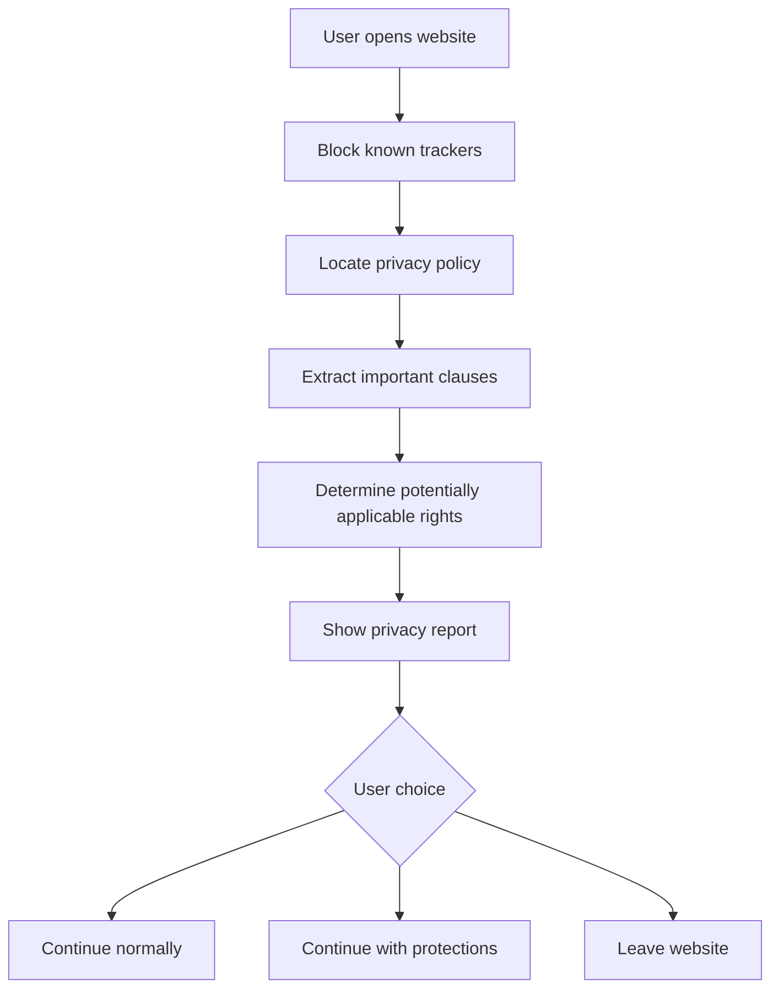

# Privacy Gate: Browser Extension Project Brief

## Project idea

Build a privacy checkpoint browser extension that helps users understand and control a website's data practices before they create an account, log in, accept cookies, or submit personal information.

> Before you give a website personal information, the extension shows what it collects, whom it shares data with, which trackers it uses, what rights may apply to you, and which privacy actions you can take.

The product should connect three stages:

**Prevent -> Understand -> Act**

- **Prevent:** Block known advertising and cross-site trackers.
- **Understand:** Find and summarize the website's privacy policy with citations.
- **Act:** Help the user opt out, request access or deletion, or leave the website.

## Important technical distinction

The extension cannot retrieve a website's privacy policy without making some connection to that website or another data source. The website will receive limited information when the browser requests the initial page.

The realistic product promise is:

> Understand the website before you give it personal information.

The product should not claim:

> Analyze the website before you visit it at all.

The extension can still:

1. Block known third-party trackers before their requests leave the browser.
2. Prevent or remove cookies from selected requests.
3. Retrieve an existing privacy-policy analysis from a cache.
4. Analyze an unknown policy while blocking other site resources.
5. Warn the user before they log in, accept cookies, or submit information.

## User flow



## Example user interface

### Privacy summary: Example.com

**Risk level: Moderate**

- Collects location, email, device identifiers, and browsing activity.
- Uses information for advertising.
- Shares information with advertising and analytics partners.
- Keeps some account information after deletion.
- Allows account deletion by emailing `privacy@example.com`.
- California residents may be able to opt out of the sale or sharing of personal information.

### Trackers detected or blocked

- Google Analytics
- Meta Pixel
- TikTok Pixel
- Advertising cookies
- Session-replay scripts

### Available actions

- Block nonessential trackers.
- Send a Global Privacy Control preference.
- Open the site's privacy opt-out page.
- Generate a data-deletion request.
- Generate a data-access request.
- Continue with temporary cookies.
- Leave the website.

## Core components

### 1. Tracker blocker

Use Chrome Manifest V3 and the `chrome.declarativeNetRequest` API to block or modify matching network requests before they are sent.

Documentation: <https://developer.chrome.com/docs/extensions/reference/api/declarativeNetRequest>

Use an established, maintained filter list such as EasyPrivacy for the first version. Do not attempt to create a comprehensive tracker database from scratch.

| Mode | Behavior |
| --- | --- |
| Standard | Block known advertising and cross-site trackers. |
| Strict | Block most third-party scripts and cookies. |
| Custom | Let users select categories and create site exceptions. |

The extension should show the number and categories of requests blocked without storing the user's browsing history.

### 2. Privacy-policy finder

Search the website for:

- `/privacy`
- `/privacy-policy`
- `/legal/privacy`
- Footer links containing "Privacy"
- Links containing "Your Privacy Choices" or "Do Not Sell"
- Relevant structured metadata

If the extension cannot find a privacy policy, report that clearly. Do not automatically treat the absence of a detected policy as proof that the company has no policy.

### 3. Policy analyzer

Extract structured information instead of returning only a general AI summary.

```json
{
  "data_collected": [],
  "purposes": [],
  "third_parties": [],
  "sale_or_sharing": "",
  "targeted_advertising": "",
  "retention": "",
  "deletion_method": "",
  "access_method": "",
  "opt_out_url": "",
  "contact": "",
  "last_updated": "",
  "unclear_terms": []
}
```

Every material claim should include:

- The relevant policy heading or section.
- A short supporting excerpt.
- A link to the original policy.
- A confidence indicator when the wording is ambiguous.

The analyzer must distinguish between information explicitly stated by the policy and conclusions inferred from it.

### 4. Rights engine

Privacy rights depend on the user's location, the company's location and activities, and whether the law applies to that particular user and organization.

The extension should distinguish between:

- Rights explicitly offered in the policy.
- Rights potentially available in the user's jurisdiction.
- Actions the website actually provides.
- Rights that require eligibility or identity verification.

Use cautious language such as "You may have this right" unless applicability has been reliably established. The extension must not claim to provide legal advice.

Initial reference sources:

- California Consumer Privacy Act overview: <https://oag.ca.gov/privacy/ccpa>
- EU data-protection framework: <https://commission.europa.eu/law/law-topic/data-protection/legal-framework-eu-data-protection_en>

### 5. Privacy actions

Help users act on what they learn:

- Enable or communicate Global Privacy Control.
- Find the website's opt-out form.
- Find account-deletion settings.
- Generate a data-access request.
- Generate a deletion request.
- Save proof that a request was submitted, with the user's permission.
- Remind the user to follow up if the company does not respond.

Global Privacy Control reference: <https://globalprivacycontrol.org/>

Do not automatically submit legally significant requests in the MVP. Let the user review and intentionally send each request.

## Potential APIs and external data

The Public APIs repository does not contain one complete privacy-policy API. The product may combine several resources.

| API or resource | Potential use |
| --- | --- |
| Google Safe Browsing | Check whether a site is known to be unsafe. |
| VirusTotal | Examine domain and URL reputation. |
| URLScan.io | Inspect services contacted by a website. |
| AbuseIPDB | Check suspicious IP infrastructure. |
| IP geolocation | Suggest potentially relevant privacy jurisdictions. |
| Text-analysis or LLM API | Classify and summarize policy clauses. |
| Screenshot API | Preserve evidence of privacy and opt-out pages. |
| Email-validation API | Check the format or availability of a privacy contact. |
| EasyPrivacy or similar lists | Identify and block known trackers. |

Public APIs repository: <https://github.com/public-apis/public-apis>

## Privacy requirements for the product itself

A privacy extension must hold itself to a higher standard than an ordinary application.

- Process tracker detection locally when possible.
- Do not maintain a central log of websites users visit.
- Do not sell browsing or policy-query data.
- Do not send every visited URL to third-party services.
- Send a policy to an external model only when necessary and disclosed.
- Minimize extension permissions.
- Explain each requested browser permission.
- Store user preferences locally by default.
- Provide a clear way to delete stored information.
- Publish the extension's source code if practical.
- Document every external service that receives data.

## MVP scope

Build these features first:

1. Create a Chrome extension using Manifest V3.
2. Block trackers using an existing filter list.
3. Locate the current website's privacy policy.
4. Extract five categories:
   - Data collected
   - Data shared
   - Advertising uses
   - Retention period
   - Deletion or opt-out instructions
5. Display detected and blocked tracker categories.
6. Link to the website's actual privacy controls.
7. Generate a reviewable deletion or data-access request.

Do not include these features in the first version:

- Definitive legal conclusions.
- Automatic submission of legal requests.
- Support for every country or state.
- A complicated numerical privacy score.
- A proprietary tracker list.
- Permanent collection of users' browsing histories.

## Suggested technical architecture

### Browser extension

- Chrome Manifest V3
- TypeScript
- React or plain HTML/CSS for the popup and report page
- `chrome.declarativeNetRequest` for request blocking
- `chrome.storage.local` for user settings
- Content scripts for locating privacy-policy links
- Background service worker for coordination

### Optional backend

- ASP.NET Core or a lightweight TypeScript API
- PostgreSQL for cached policy analyses
- Scheduled policy rechecking based on the policy's `last_updated` value
- LLM or text-classification service for structured extraction

The first prototype can run mostly inside the extension. Add a backend only when policy caching, shared analysis, authentication, or rate-limit management becomes necessary.

## Primary users

Start with university students who frequently create accounts for:

- Textbook platforms
- Job applications
- AI tools
- Productivity software
- School-related services
- Free trials

This group is accessible for interviews and usability testing. Do not assume students will pay until that has been tested.

## Validation questions

Interview potential users before building the complete product:

1. When was the last time you avoided reading a privacy policy because it was too long?
2. Have you ever wanted to know what a website would collect before creating an account?
3. What would cause you to leave a website rather than register?
4. Would seeing trackers change your behavior?
5. Which action is most valuable: blocking, summarizing, opting out, or deleting data?
6. Do you currently use a tracker blocker? Why or why not?
7. Would an interruption on every website become annoying?
8. When should the extension appear automatically?
9. Would you trust an AI summary if it linked every claim to the policy?
10. Who would pay for this product, if anyone?

## Success metrics

- Percentage of visited sites where a policy is successfully located.
- Accuracy of the five structured policy categories.
- Percentage of claims supported by a valid source location.
- Number and categories of trackers blocked.
- Time required for a user to understand a site's practices.
- Percentage of reports that lead to an intentional privacy action.
- False-positive blocking rate and number of broken websites.
- Percentage of users who keep the extension installed.

## Working names

- Privacy Gate
- Before I Agree
- TermsLens
- ClearConsent

## Initial build instruction for Codex

Use this brief as the product specification. Begin by creating a minimal Chrome Manifest V3 extension called **Privacy Gate**. Before writing substantial code:

1. Propose the repository structure and technical architecture.
2. Identify the minimum Chrome permissions required and explain each one.
3. Define the threat model and privacy guarantees of the extension itself.
4. Separate MVP requirements from later features.
5. Ask for clarification on any decision that materially affects privacy, data retention, legal claims, or external API usage.

For the first implementation, prioritize local processing, minimal permissions, verifiable policy citations, and a small working vertical slice over broad feature coverage.
